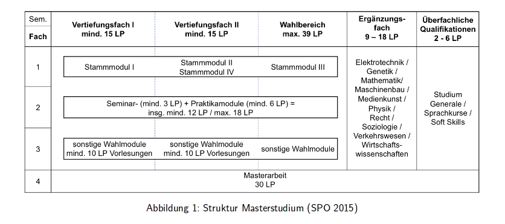
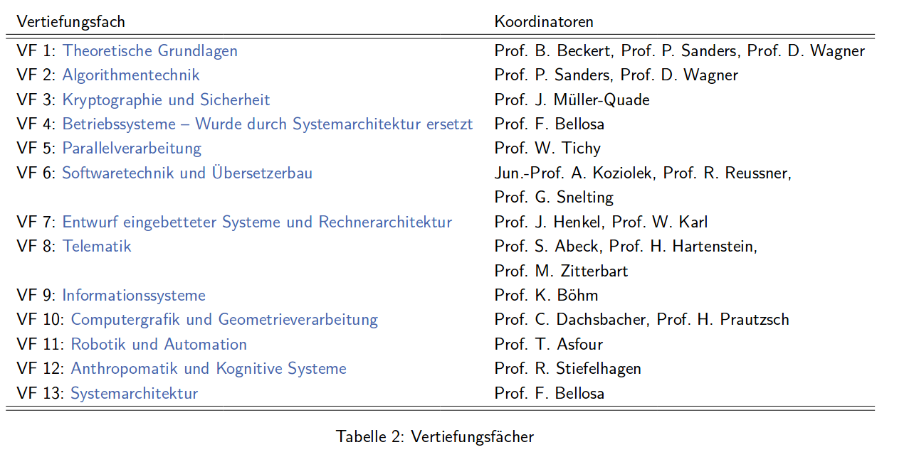

Dieser Artikel beschreibt, wie man sich den Master Informatik nach SPO-2015 zusammenstellen kann.
Wenn du diesen Artikel durchgelesen hast, dann weißt du, wie der Master strukturiert ist
und worauf du achten musst.

Alle Informationen sind folgenden Quellen zu entnehmen:

 - [Alle Formulare Informatik](https://www.informatik.kit.edu/formulare.php)
 - [Modulhandbuch WS 2018/19](https://cs-k.it/modul)
 - [Wiki Informatik](https://cs-k.it/wiki)

## Struktur

Der Master soll vier Semester dauern. Das grobe Gerüst sieht wie folgt aus:

Es gibt sechs Bereiche im Masterstudium:

 - Stammmodule: Man muss vier von ihnen wählen (In unterschiedliche Gebiete schnuppern/einsteigen)
 - Zwei Vertiefungsfächer (vermutlich zusammenhängende Vorlesungen mit Seminar und Praktikum)
 - Wahlbereich: Alles, was man sonst so belegen kann aus der Informatik
 - Ergänzungsfach: Vorlesungen aus Anwendungsgebieten (Mathe, Physik, ...)
 - Überfachliche Qualifikation (Soft-Skills, Sprachen...)
 - Masterarbeit

### Arbeitsaufwand

Man arbeitet am KIT für LP (Leistungspunkte). Auf Englisch sind das ECTS.

Das Modulhandbuch sagt:

      "Dabei entspricht ein Leistungspunkt einem Aufwand von
      ca. 30 Arbeitsstunden für einen durchschnittlichen Studierenden."

**Nachgerechnet:**
Eine Vorlesung mit 6 LP hat also 180 Arbeitsstunden. Das Wintersemester besteht aus 12 Wochen,
das heißt eine 6-LP-Wochenstunde hat 15 Wochenarbeitsstunden.  
=> Bei 30 LP im Wintersemester wären das 75 Wochenstunden
*(Hoffentlich ist da ein Rechenfehler drin!)*

      Beispiel Zusammensetzung der Stunden für Algorithmen II:
      6 LP entspricht ca. 180 Stunden
      ca. 45 Std. Vorlesungsbesuch,
      ca. 15 Std. Übungsbesuch,
      ca. 90 Std. Nachbearbeitung und Bearbeitung der Übungsblätter
      ca. 30 Std. Prüfungsvorbereitung

### Prüfungen wiederholen

Das Modulhandbuch sagt:

      "Jede Prüfung kann einmal wiederholt werden".

Meiner Interpretation nach ist das nicht abhängig davon, ob man durchgefallen ist
oder nur einen Verbesserungsversuch schreiben möchte.

Eine "Mülltonnenregelung" wie an der LMU gibt es wohl nicht. Da konnte man die
schlechtesten Ergebnisse nicht in den Schnitt einberechnen lassen.

**Bei zweimaligem Nicht-Bestehen: Exmatrikulation und Prüfungsanspruchsverlust**

Modulhandbuch:

      "Grundsätzlich kann jede Erfolgskontrolle (mündlicher, schriftlicher oder
        anderer Art) einmal wiederholt werden. Im Falle einer schriftlichen
        Prüfung erfolgt nach zweimaligem Nichtbestehen zeitnah
        (in der Regel im selben Prüfungszeitraum)eine mündliche Nachprüfung.
        In dieser können nur noch die Noten “ausreichend” (4,0) oder
        “nicht ausreichend” (5,0) vergeben werden. Ist eine Prüfung endgültig
        nicht bestanden, so gilt der Prüfungsanspruch im Fach Informatik und
        für alle artverwandten Studiengänge als verloren. Eine Teilnahme an
        weiteren Prüfungen ist nicht möglich."

**Abmeldung von Klausuren**

      "Danach ist ohne Angabe von Gründen bis zur Ausgabe der Prüfungsaufgaben
      bei schriftlichen Prüfungen eine Abmeldung (persönlich und schriftlich)
      nur noch direkt beim zuständigen Prüfer möglich. Die Abmeldung von einer
      mündlichen Prüfung erfolgt beim zuständigen Prüfer bzw. seinem Sekretariat.
      Die Abmeldung muss spätestens drei Werktage vor dem Prüfungstermin erklärt
       werden. Ein persönliches Erscheinen kann für die Abmeldung verlangt werden. "

Siehe auch im [Wiki zu Prüfungen](https://www.informatik.kit.edu/faq-wiki/doku.php?id=pruefungen)

### Verlorene LP

Vorlesungen, Seminare und Praktika können zu **Modulen** gruppiert werden.
Wenn man mehr LP als nötig in einem Modul hat, dann werden die überschüssigen
einfach abgeschnitten. In die Notenberechnung fließt die Leistung dennoch ein.

Das heißt mehr Arbeit für eine minimale Verbesserungschance.

      "Werden durch die belegten Studien- und Prüfungsleistungen in einem Modul mehr LP
       als dem Modul zugeordnet sind erreicht, so werden die überschüssigen LP auf die
       Modulgröße abgeschnitten. Die Note des Moduls berechnet sich mit Berücksichtigung
      aller im Modul erbrachten LP."

Siehe hierzu:

 - [LP Verschnitt im Wiki](https://www.informatik.kit.edu/faq-wiki/doku.php?id=lp-verschnitt)
 - [Notenberechnung im Wiki](https://www.informatik.kit.edu/faq-wiki/doku.php?id=notenberechnung)

## Stammmodule

Man muss vier Stammmodule belegen. Alle haben 6 LP.

Laut Modulhandbuch:

      "Stammmodule vermitteln erweiterte Grundlagen aus sehr spezifischen Bereichen der Informatik."

**Im Wintersemester gibt es andere Stammmodule als im Sommersemester.**

**Überlegung:** Wenn man im ersten Semester die vier Stammmodule belegt, dann kommt man bereits auf
4x6 ECTS = 24 ECTS. Dann hat man sich noch nicht für ein Profil oder Vertiefungsfach
entschieden und kann quasi noch abwarten, welche Vorlesung einem am besten gefällt.
Jedoch muss man beachten, dass jedes Studienprofil das ein oder andere Stammmodul verlangt.

## Vertiefungsfächer

Wähle zwei Vertiefungsfächer (á 15 - 52 LP) aus der folgenden Liste:

      "Für Studierende, die nach der SPO 2015 studieren, gilt außerdem: In jedem
      Vertiefungsfach müssen mind. 10 LP aus Vorlesungen (keine Stammvorlesungen)
      erbracht werden. Ausnahme bildet VF8 Telematik: Im VF Telematik müssen
      mind. 8 LP aus Vorlesungen (keine Stammvorlesung) erbracht werden.
      Anstelle mehrerer mündlicher Prüfungen zu Modulen eines Vertiefungsfachs
      kann eine modulübergreifende Prüfung zu diesen Modulen durchgeführt werden.
      Darüber entscheidet der/die Prüfer/in. Insgesamt können in einem
      Vertiefungsfach bis zu 52 LP erbracht werden, jedoch können insgesamt im
      Studium nicht mehr als 120 LP absolviert werden."

**ACHTUNG! 12-18 LP durch Vertiefungsfächer und Wahlbereich. Mindestens 3 LP Seminare. Mindestens 6 LP Praktika.**

      "Für Studierende, die nach der SPO 2015 studieren, gilt: Es müssen mind.
      3 LP durch Seminare und mind. 6 LP durch Praktika in den Vertiefungsfächern
      und dem Wahlbereich erbracht werden. Insgesamt müssen mind. 12 LP durch Praktika
      und Seminare erbracht werden (s. auch. Abbildung 1).
      Für alle Studierenden gilt: Es dürfen insgesamt max. 18 LP durch Praktika
      und Seminare erbracht werden."

## Wahlbereich

Der Rest an Leistungspunkten wird durch Veranstaltungen aus dem Wahlbereich aufgefüllt (12 - 49 LP):

      "Maximal stehen für den Wahlbereich (SPO 2015) 49 LP zur Verfügung (120 LP
      abzüglich der Pflichtleistungen in den anderen Fächern sowie der Masterarbeit)."

Die Liste aller Veranstaltungen kann dem [Vorlesungsverzeichnis](cs-k.it/vlv)
entnommen werden oder der [Modulhandbuch](cs-k.it/modul).

**ACHTUNG! 12-18 LP durch Vertiefungsfächer und Wahlbereich. Mindestens 3 LP Seminare. Mindestens 6 LP Praktika.**
(Siehe oben)

## Ergänzungsfach

Wähle Module von 9 - 18 LP (SPO 2015) aus Gebieten, in denen die Informatik zur Anwendung kommt.

## Überfachliche Qualifikation

      "Teil des Studiums ist auch der Erwerb von Überfachlichen Qualifikationen
      im Umfang von 2 – 6 Leistungspunkten (SPO 2015). Zu diesem Bereich zählen
      überfachliche Veranstaltungen zu gesellschaftlichen Themen,
      fachwissenschaftliche Ergänzungsangebote, welche die Anwendung des Fachwissens
      im Arbeitsalltag vermitteln, Kompetenztrainings zur gezielten Schulung von
       Soft Skills sowie Fremdsprachentrainings."

Besuche Veranstaltungen von folgenden Organisationen (2-6 LP). Die Note der Veranstaltung
kann zwar übertragen werden, wird aber nicht in den Schnitt miteinberechnet.

- House of Competence (HoC)
- Zentrum für angewandte Kulturwissenschaften (ZAK)
- Sprachenzentrums (SpZ)

## Masterarbeit

Die Masterarbeit macht 30 ECTS aus. Soll in 6 Monaten bearbeitet werden.
Die Präsentation muss innerhalb von vier Wochen nach der Abgabe gehalten werden.
Man kann einmal sein Thema innerhalb von einem Monat nach Erhalt "zurückgeben".

[Allgemeine Informationen zur Masterarbeit im Wiki](https://www.informatik.kit.edu/faq-wiki/doku.php?id=masterarbeit_allg)

## Studienprofile

 Seit dem Wintersemester 2017/18 kann man Profile wählen. Das ist sowas wie eine
 Orientierungshilfe, um sich in eine Richtung zu spezialisieren (kein Mehraufwand).

Es gibt folgende Profile
(siehe [https://www.informatik.kit.edu/9378.php](https://www.informatik.kit.edu/9378.php)):

1. Daten-intensives Rechnen
2. Energieinformatik
3. Internet und Gesellschaft
4. IT-Sicherheit
5. Künstliche Intelligenz
6. Multi-Scale Computing Systems
7. Robotik
8. Software Engineering
9. Visual Computing

Folgende Auszüge aus dem Modulhandbuch sind interessant im Bezug auf die Profile:

**Studienplan am Anfang des Semesters festlegen:**

      "Studierenden, die ein Profil absolvieren möchten, wird stark empfohlen,
      am Anfang des Studiums einen Studienplan zu erstellen. Dafür steht Anlage 1
       zur Verfügung (siehe auch http://www.informatik.kit.edu/formulare.php#block1936).
      Der Studienplan kann zur Planungssicherheit im Rahmen einer Beratung beim
      Informatik Studiengangservice (ISS) überprüft werden
      (http://www.informatik.kit.edu/3724.php). Der ISS überprüft zusammen mit
      dem/der Studierenden, ob die Bedingungen für das Studienprofil und für den
      Masterstudiengang erfüllt sind."

**Auswirkungen eines Studienprofils:**

      "In der Regel beschränkt ein Studienprofil die thematische Ausrichtung der
      Masterarbeit und enthält Regelungen zur Wahl von Modulen im Umfang von mindestens
      45 Leistungspunkten. [...] Ein Studienprofil kann Bedingungen aufstellen zu
      – dem Themenbereich der Masterarbeit,
      – den zu wählenden Vertiefungsfächern,
      – dem zu wählenden Ergänzungsfach,
      – den innerhalb der Vertiefungsfächer, dem Ergänzungsfach und der
      Überfachlichen Qualifikationen zu belegenden Modulen
      (einschließlich Stammmodulen, Praktika und Seminaren)."
